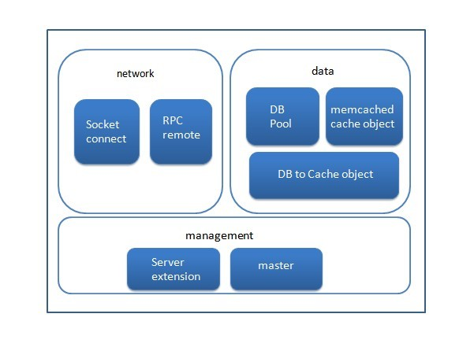
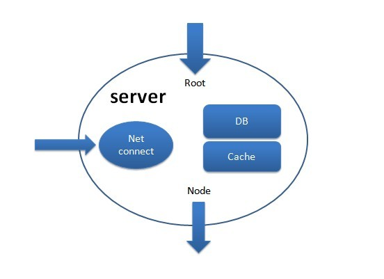

firefly
=======

<body class="single single-post postid-31 single-format-standard custom-background single-author singular two-column right-sidebar">

	

		

			

					
<article id="post-31" class="post-31 post type-post status-publish format-standard hentry category-firefly">
	<header class="entry-header">
		<h1 class="entry-title">Firefly Game Server Framework是什么？</h1>

			</header><!-- .entry-header -->

	

		
&nbsp; &nbsp; &nbsp; &nbsp; Firefly is a free, open source, stable and rapid expansion, to "hot update" distributed game server side framework。Written in Python, based on the Twisted framework development。Firefly's design philosophy is to "let developers focus on front-end"，It includes a development framework and database caching services, and other basic services game servers，Save a lot of game developers working hours，Truly allows the user to focus on gameplay logic。It can be used to build a custom distributed architecture, only need to modify the configuration file to the appropriate。

<strong>Benefits Features</strong><b></b>

<ul>
<li>Single-threaded multi-process architecture, distributed architecture supports custom；</li>
<li>Convenient server extension mechanism that can rapidly expand the server type and quantity；</li>
<li>Long with the client using TCP connection, without considering issues such as stick package；</li>
<li>Packaging Data Cache Service；</li>
<li>Can achieve real-time thermal profile data as well as game logic, the client player without feeling；</li>
<li>There are dozens of basic gameplay system modules assembled using (v1.3.0 available)；</li>
</ul>

<strong>Frameworks introduced</strong>

<ul>
<li>management, firefly is a multi-process, distributed game server。So each game server (process) management and extensions are firefly very important part of the framework by abstracting the server extensions very easy。</li>
<li>Network，Client connects communications, server inter-process communication, etc. constitute the entire game framework in the context，All games in this context processes are built on。Communication with the client uses a request / response style, so by the client's request, the server will give the appropriate response，The server can also take the initiative to push the message broadcast to the client。These requests are based on a request instruction number。（Such as defining 101 for the landing instructions）communication between the server process using the asynchronous callback method, thus reducing the inter-process communication in the network time-consuming。</li>
<li>Data, Data processing is an important part of online games。In online games have a lot of data needs to be stored, needs to be updated, which makes the database server to read and write efficiency become the biggest performance bottlenecks。firefly's db processing can be a database table data cache to memcache in the form of objects and are able to carry out the corresponding object method calls to manipulate data。In a different process by instantiating instances of the same name cache, the data are synchronized。Cache object and can write data back to the database。</li>
</ul>

<strong>Framework for thinking</strong><b></b>

<b>&nbsp; &nbsp; &nbsp; &nbsp;&nbsp;</b>A basic server that is running a non-stop applications。In a distributed game server, we need to have a server function, listen for client connections, monitor other services processes messages to connect to other service process，Some require a database connection and caching services。As shown

&nbsp;

net connect Handle client connections，Other news monitoring service process root，node to connect to other service process，db database，“cache” database，cache 。Do they need to listen for client connections, whether listening other service processes messages, etc. This is all can be configured in config.json,Including the name of the server as well as the various connections between each server。So you can customize their own distributed architecture。

			
<!-- .entry-content -->

</article><!-- #post-31 -->

				
			
<!-- #content -->
		
<!-- #primary -->

	
<!-- #main -->

</body>